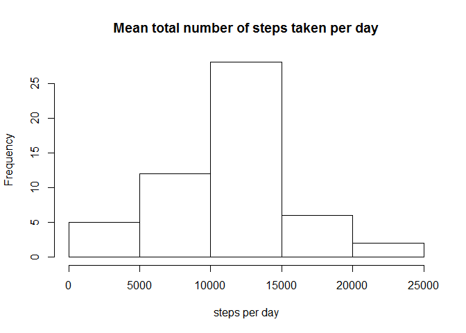
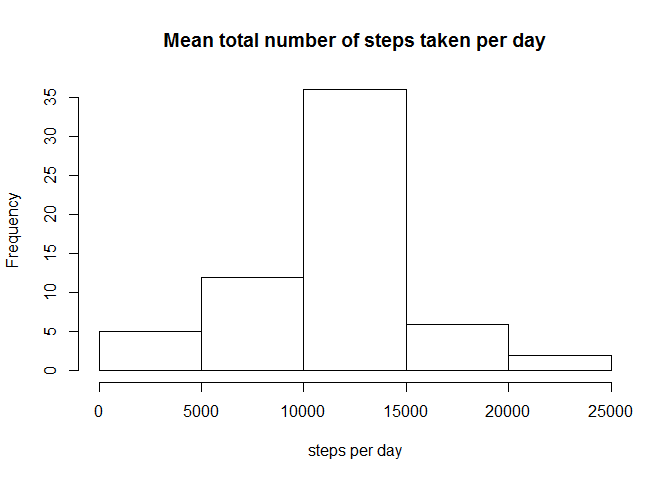

# Reproducible Research: Peer Assessment 1


## Loading and preprocessing the data

- Load the data and store it into `activity_data`.


```r
raw_data <- read.csv("activity.csv")
```

- Process the data by removing `NA` values.


```r
activity_data <- raw_data[which(raw_data$steps!= "NA"), ]
```

## What is mean total number of steps taken per day?

- Plot the mean total number of steps taken per day to a histogram.


```r
total_steps <- aggregate(steps~date, data=activity_data, sum, na.rm=TRUE)
hist(total_steps$steps, main="Mean total number of steps taken per day", xlab="steps per day")
```

 

- Calculate and report the mean and median total number of steps taken per day.


```r
mean_total_steps <- mean(total_steps$steps)
median_total_steps <- median(total_steps$steps)
```

The mean total number of steps taken per day is 1.0766189\times 10^{4} steps.  
The median total number of steps taken per day is 10765 steps.

## What is the average daily activity pattern?

- Make a time series plot(with `type = "l"`) of the 5-minute interval (x-axis) and the average number of steps taken, averaged across all days (y-axis)


```r
steps_interval <- aggregate(steps~interval, data=activity_data, mean, na.rm=TRUE)
plot(steps~interval, data=steps_interval, type="l")
```

 

- Which 5-minute interval, on average across all the days in the dataset, contains the maximum number of steps?


```r
interval_with_max_steps <- steps_interval[which.max(steps_interval$steps),]$interval
```

The 835th interval contains the maximum number of steps.

## Imputing missing values

- Calculate and report the total number of missing values in the dataset (i.e. the total number of rows with `NA`s).


```r
total_missing <- sum(is.na(raw_data$steps))
```

There are total 2304 rows are missing in the raw dataset.

- Devise a strategy for filling in all of the missing values in the dataset. The strategy does not need to be sophisticated. For example, you could use the mean/median for that day, or the mean for that 5-minute interval, etc.

Filing in all of the missing values with the mean for that 5-minute interval.


```r
interval2steps <- function(interval) {
    steps_interval[steps_interval$interval==interval,]$steps
}

filled_activity <- raw_data
for(i in 1:nrow(filled_activity)) {
    if(is.na(filled_activity[i,]$steps)) {
        filled_activity[i,]$steps <- interval2steps(filled_activity[i,]$interval)
    }
}
```

- Make a histogram of the total number of steps taken each day and Calculate and report the mean and median total number of steps taken per day.


```r
filled_total_steps <- aggregate(steps~date, data=filled_activity, sum)
hist(filled_total_steps$steps, main="Mean total number of steps taken per day", xlab="steps per day")
```

 

```r
filled_mean <- mean(filled_total_steps$steps)
filled_median <- median(filled_total_steps$steps)
```

The new mean total number of steps taken per day is 1.0766189\times 10^{4} steps.  
The new median total number of steps taken per day is 1.0766189\times 10^{4} steps.

- Do these values differ from the estimates from the first part of the assignment? What is the impact of imputing missing data on the estimates of the total daily number of steps?

Imputing the NA values has **raised** the median a little. And the mean value remains the **same**.

## Are there differences in activity patterns between weekdays and weekends?

- Create a new factor variable in the dataset with two levels - "weekday" and "weekend" indicating whether a given date is a weekday or weekend day.


```r
filled_activity$day <- ifelse(
  as.POSIXlt(as.Date(filled_activity$date))$wday %% 6==0,
  "weekend",
  "weekday")
filled_activity$day <- factor(filled_activity$day, levels=c("weekday", "weekend"))
```

- Make a panel plot containing a time series plot (i.e. `type = "l"`) of the 5-minute interval (x-axis) and the average number of steps taken, averaged across all weekday days or weekend days (y-axis).


```r
library(lattice)
steps_interval2 <- aggregate(steps~interval+day, filled_activity, mean)
xyplot(steps~interval|factor(day), data=steps_interval2, aspect=1/2, type="l")
```

 
